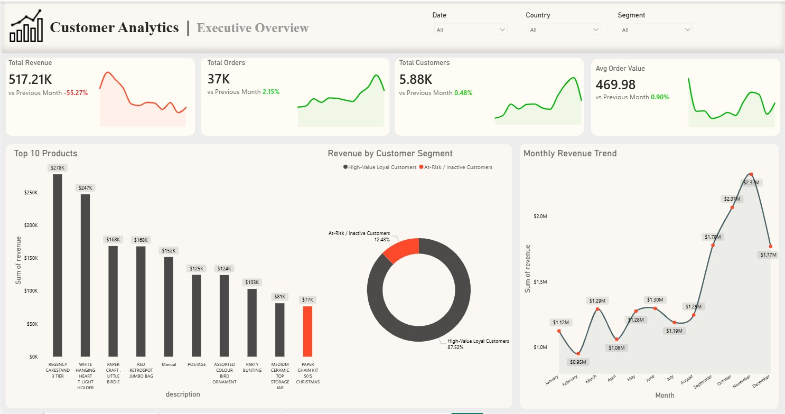
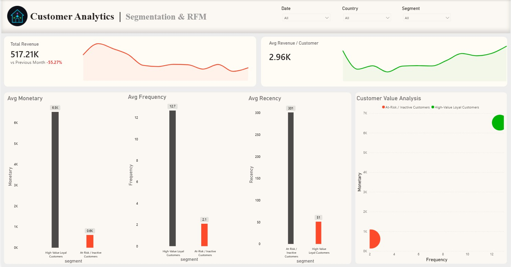
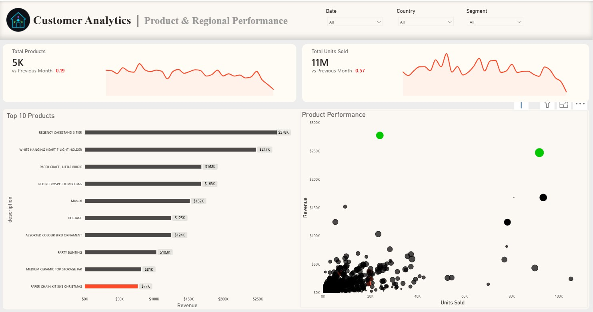
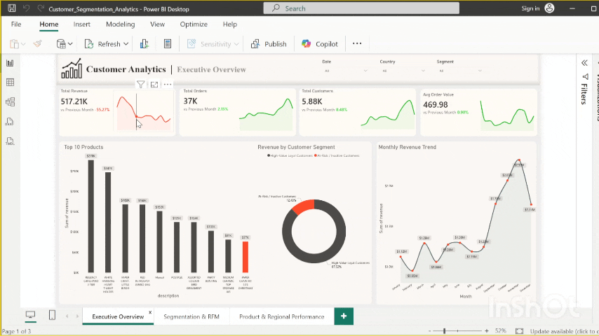
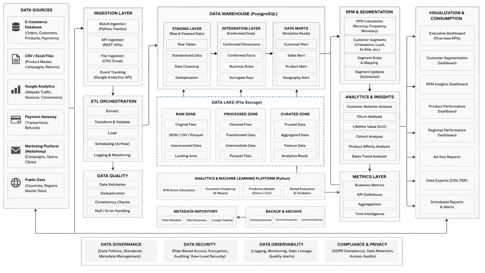
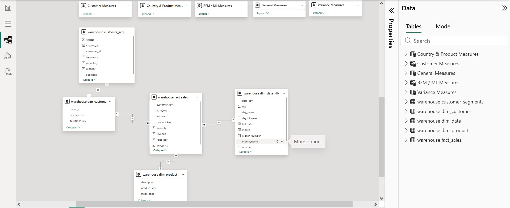

  

# Customer Segmentation and RFM Analytics

An end-to-end customer analytics project focused on **Customer Segmentation** and **RFM (Recency, Frequency, Monetary) Analysis** to understand customer behavior, improve targeting, and support data-d[...] 

This project combines **PostgreSQL**, **SQL-based warehousing**, **Python**, **Machine Learning**, and **Power BI** to analyze sales, customer patterns, product trends, and regional performance.

---

## ✨ Project Summary

Understanding customers is essential for sustainable growth. This project builds a complete analytics workflow that:

- Collects and structures customer and sales data
- Transforms raw data into an analysis-ready warehouse
- Computes RFM metrics for each customer
- Segments customers into actionable groups
- Visualizes performance through interactive business intelligence reports

The final outputs help answer questions like:

- Who are the most valuable customers?
- Which customer groups are at risk of churn?
- Which regions/products generate the highest revenue?
- How can retention and marketing campaigns be optimized?

---

## 🖼️ Reports Preview

### Executive Overview

### Customer Segmentation & RFM

### Regional Performance

---

## Report Demo

## 🏗️ Project Architecture

## Model View

### Typical architecture flow in this project

1. **Data Source Layer**  
   Raw customer, orders, sales, and product datasets

2. **Data Warehouse Layer (PostgreSQL + SQL)**  
   - Data cleaning  
   - Transformation  
   - Fact & dimension modeling  
   - Analytical views

3. **Analytics & Modeling Layer (Python + ML)**  
   - RFM metric generation  
   - Segmentation logic  
   - Optional clustering/classification models

4. **Visualization Layer (Power BI)**  
   - KPIs and trends  
   - Segment-wise analysis  
   - Product and regional performance reporting

---

## 🧰 Tech Stack

- **Database:** PostgreSQL  
- **Query Language:** SQL  
- **Programming:** Python  
- **Notebook Environment:** Jupyter Notebook  
- **Visualization:** Power BI  
- **Analytics Methods:** RFM Analysis, Customer Segmentation, Exploratory Data Analysis, ML-assisted insights

---

## 🔍 Core Analytics Covered

- **Customer Analytics**
  - Segment-wise behavior tracking
  - Repeat vs one-time customer analysis
  - Retention opportunity identification

- **RFM Analytics**
  - Recency scoring (latest engagement)
  - Frequency scoring (purchase repetition)
  - Monetary scoring (customer value)

- **Sales & Product Analytics**
  - Product-wise contribution
  - Revenue trend analysis
  - High/low performing category insights

- **Regional Analytics**
  - Region-wise sales distribution
  - Location performance benchmarking

## ⚙️ Workflow

1. Data ingestion from transactional/business datasets  
2. Data cleaning and transformation using SQL  
3. Warehouse modeling in PostgreSQL  
4. RFM feature engineering  
5. Customer segmentation and analytical modeling in Python  
6. KPI/dashboard development in Power BI  
7. Insight extraction for decision-making

---

## 📈 Business Impact

This project enables organizations to:

- Improve campaign targeting using segment-based strategies
- Identify high-value and at-risk customers faster
- Drive retention through data-backed engagement plans
- Track product and regional performance in one analytics view
- Support strategic planning with interactive dashboards

---

## 🚀 How to Use

1. Clone the repository
2. Set up PostgreSQL and execute SQL scripts
3. Run notebooks for feature engineering and segmentation
4. Open Power BI dashboard/report files
5. Replace image placeholders in this README with your actual visuals

---

## 🔮 Future Enhancements

- Automated ELT/ETL pipeline scheduling
- Real-time customer scoring
- Advanced clustering and recommendation models
- Segment-wise campaign simulation
- Cloud deployment for scalable analytics

---

## 👤 Author

**Rizwan Hussain**  
GitHub: [@RizwanHussain02](https://github.com/RizwanHussain02)

---
